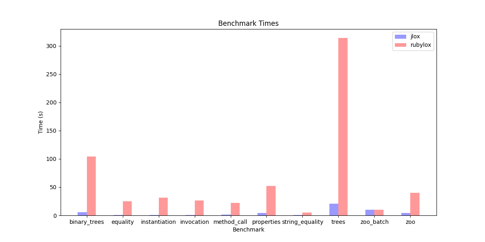
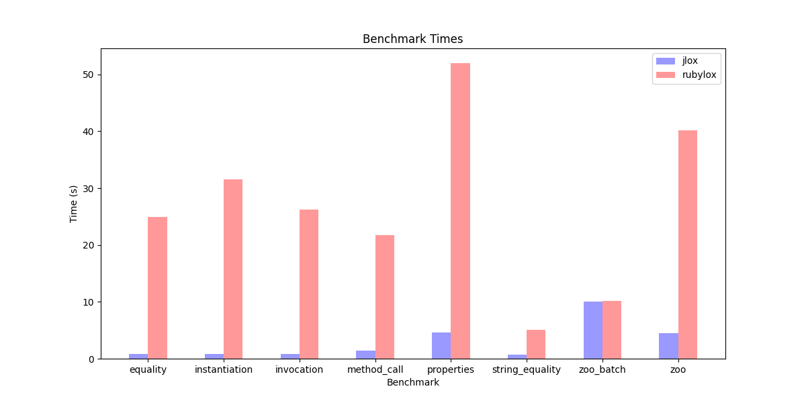
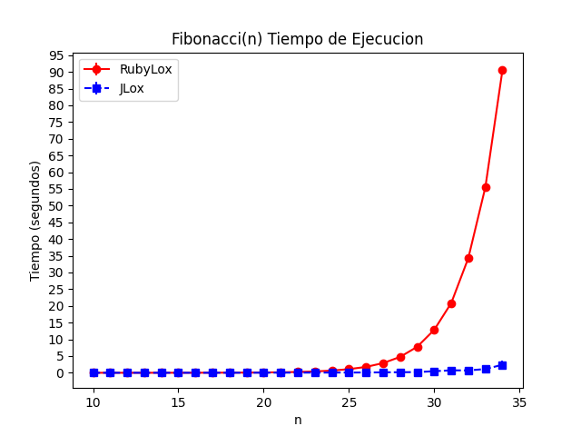

# Rubylox

This is a Ruby 3.x interpreter of the Lox programming language from
[Crafting Interpreters](https://craftinginterpreters.com/)

## Usage
1. Clone the repo
2. Run `bundle install`
3. Run `bundle exec exe/rubylox lox_programs/fibonacci.lox` or whatever script you want to run.

## Features/Chapters Implemented
- [x] Scanning
- [x] Parsing
- [x] Evaluating
- [x] Statements
- [x] Expressions
- [x] Control Flow
- [x] Function Calling
- [x] Function Definition
- [x] Resolving and Binding
- [x] Classes
- [x] Inheritance

## Some things that could be done
- [ ] Overall Cleanup
- [ ] Better error handling and reporting
- [ ] Better test coverage
- [ ] CLI REPL
- [ ] Extra exercises from the book
- [ ] Maybe extra features not in the book

## Benchmarks
I've run benchmarks against the oficial Java implementation from the book in
my Macbook Air M1 2020. It's uuhh... pretty slow.

